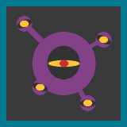

# Details: Beamable Sample Project

This sample project demonstrates specific [Beamable](https://beamable.com/) features and services.

**Project Configuration**
* `Unity Target` - Standalone MAC/PC
* `Unity Version` - 2019.4.22f1 or above
* `Unity Rendering` - [Unity Standard Renderer (Legacy)](https://docs.unity3d.com/Manual/shader-StandardShader.html)

**Project Structure**
* `README.md` - This README file
* `client/` - Open this folder in the Unity Editor
* `client/Assets/` - Core files of the project
* `client/Assets/Scenes/` - **Open a scene** in the Unity Editor to play the game!
* `client/Assets/3rdParty/` - Dependency asset files for the project
* `client/Packages/` - Dependency package files for the project

**Beamable SDK**
* **Included**: This project includes the Beamable SDK for Unity
* **Version**: The latest public release as of each GIT commit

# Overview: Microservices BBB Sample Project

### What is "Beamable Boss Battles"?
The Hero has reached the dungeon. Battle the Boss to win. This sample project allows game makers to understand and apply the benefits of Microservices in game development.
 [Microservices - Sample Project](https://docs.beamable.com/docs/microservices-sample-project)

### What is Beamable?
Beamable is the low-code option for rapidly adding social, commerce, and content management features to your live game. Learn how to do that with Beamable's online product documentation.
 [docs.beamable.com](https://docs.beamable.com/)

### What is Beamable's "Microservices" Feature?
The purpose of this feature is to allow game makers to create and deploy server-authoritative C# functionality within their games.
 [Microservices](https://docs.beamable.com/docs/microservices)

### Got feedback?
Let us know what you think or ask any questions you might have.
 [Contact Us](https://docs.beamable.com/discuss)
